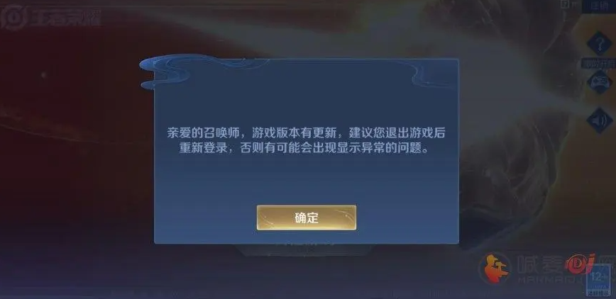

# Creator热更新

## 1、什么是热更新

当你下载一个游戏，比如王者荣耀，打开时发现提示有新的资源包要让你更新，那就是使用了热更新。



热更新主要是用于原生环境的andriod和ios，对于小游戏不用，小游戏是审核过后，打开原来的小游戏马上就会更新，而安装包 .apk/.ipa已经是安装在手机上了。如果不把原来的游戏卸载，再去下载更新过的游戏，那么是玩不到更新过的游戏，一直是老版本。

而热更新就是玩家不用去下载新版本，直接更新资源包就能更新这个游戏，当你将这个游戏（应用包）的所有数据清空后，你发现这个游戏又变成了老版本。

所以经过热更新后·是把有变化的资源存在缓存中，游戏中使用的资源，优先是使用搜索到缓存中的资源。

## 2、Creator中的热更新

Cocos Creator 中的热更新主要源于 Cocos 引擎中的 AssetsManager 模块对热更新的支持。它有个非常重要的特点：

**服务端和本地均保存完整版本的游戏资源**，热更新过程中通过比较服务端和本地版本的差异来决定更新哪些内容。这样即可天然支持跨版本更新，比如本地版本为 A，远程版本是 C，则直接更新 A 和 C 之间的差异，并不需要生成 A 到 B 和 B 到 C 的更新包，依次更新。所以，在这种设计思路下，新版本的文件以离散的方式保存在服务端，更新时以文件为单位下载。

除此之外，由于 WEB 版本可以通过服务器直接进行版本更新，所以资源热更新只适用于原生发布版本。AssetsManager 类也只在 jsb 命名空间下，在使用的时候需要注意判断运行环境。

### 2.1、使用Manifest文件

对于不同版本的文件级差异，AssetsManager 中使用 Manifest 文件来进行版本比对。本地和远端的 Manifest 文件分别标示了本地和远端的当前版本包含的文件列表和文件版本，这样就可以通过比对每个文件的版本来确定需要更新的文件列表。

Manifest 文件中包含以下几个重要信息：

1. 远程资源包的根路径
2. 远程 Manifest 文件地址
3. 远程 Version 文件地址（非必需）
4. 主版本号
5. 文件列表：以文件路径来索引，包含文件版本信息，一般推荐用文件的 md5 校验码来作为版本号
6. 搜索路径列

其中 Version 文件内容是 Manifest 文件内容的一部分，不包含文件列表。由于 Manifest 文件可能比较大，每次检查更新的时候都完整下载的话可能影响体验，所以开发者可以额外提供一个非常小的 Version 文件。AssetsManager 会首先检查 Version 文件提供的主版本号来判断是否需要继续下载 Manifest 文件并更新。

### 2.2、Creator热更新原理

 对于 Cocos Creator 来说，所有 JS 脚本将会打包到 src 目录中，其他 Assets 资源将会被导出到 assets 目录。

基于这样的项目结构，本篇教程中的热更新思路很简单：

1. 基于原生打包目录中的 assets 和 src 目录生成本地 Manifest 文件。
2. 创建一个热更新组件来负责热更新逻辑。
3. 游戏发布后，若需要更新版本，则生成一套远程版本资源，包含 assets 目录、src 目录和 Manifest 文件，将远程版本部署到服务端。
4. 当热更新组件检测到服务端 Manifest 版本不一致时，就会开始热更新

> **注意**：项目中包含的 `remote-assets` 为 debug 模式，开发者在测试的时候必须使用 debug 模式构建项目才有效，否则 release 模式的 jsc 文件优先级会高于 `remote-assets` 中的资源而导致脚本失效。

### 2.3、Creator简单实现

使用场景：比如当前版本1.0，远端服务器版本已经是2.0版本了，此时需要将当前版本的更新为2.0版本，就需要更新。

使用方式：比如**version_generator.js**（[GitHub](https://github.com/cocos-creator/tutorial-hot-update/blob/2.4.x/version_generator.js) | [Gitee](https://gitee.com/mirrors_cocos-creator/tutorial-hot-update/blob/2.4.x/version_generator.js)）这是一个用于生成 Manifest 文件的 NodeJS 脚本。使用方式如下：

~~~js
> node version_generator.js -v 1.0.0 -u http://your-server-address/tutorial-hot-update/remote-assets/ -s native/package/ -d assets/
~~~

参数说明：

- `-v` 指定 Manifest 文件的主版本号。
- `-u` 指定服务器远程包的地址，这个地址需要和最初发布版本中 Manifest 文件的远程包地址一致，否则无法检测到更新。
- `-s` 本地原生打包版本的目录相对路径。
- `-d` 保存 Manifest 文件的地址。

官方文档范例工程的热更新组件的实现位于 `assets/scripts/module/HotUpdate.js`（[GitHub](https://github.com/cocos-creator/tutorial-hot-update/blob/2.4.x/assets/scripts/module/HotUpdate.js) | [Gitee](https://gitee.com/mirrors_cocos-creator/tutorial-hot-update/blob/2.4.x/assets/scripts/module/HotUpdate.js)）中，开发者可以参考这种实现，也可以自由地按自己的需求修改。

除此之外，范例工程中还搭配了一个 `Canvas/update` 节点用于提示更新和显示更新进度供参考。即更新弹框。


需要修改本地的以下几个地方来让游戏可以成功找到远程包：

> 1. `assets/project.manifest`：游戏的本地 Manifest 文件中的 `packageUrl`、`remoteManifestUrl` 和 `remoteVersionUrl`
> 2. `remote-assets/project.manifest`：远程包的 Manifest 文件中的 `packageUrl`、`remoteManifestUrl` 和 `remoteVersionUrl`
> 3. `remote-assets/version.manifest`：远程包的 Version 文件中的 `packageUrl`、`remoteManifestUrl` 和 `remoteVersionUrl`

给 `main.js` 附加上搜索路径设置的逻辑：

```
// 在 main.js 的开头添加如下代码
if (cc.sys.isNative) {
    var hotUpdateSearchPaths = cc.sys.localStorage.getItem('HotUpdateSearchPaths');
    if (hotUpdateSearchPaths) {
        jsb.fileUtils.setSearchPaths(JSON.parse(hotUpdateSearchPaths));
    }
}
```

或者直接使用项目仓库根目录下的 `main.js` 覆盖原生打包文件夹内的 `main.js`。注意，每次使用 Cocos Creator 构建后，都需要重新修改 `main.js`。

这一步是必须要做的原因是，热更新的本质是用远程下载的文件取代原始游戏包中的文件。Cocos2d-x 的搜索路径恰好满足这个需求，它可以用来指定远程包的下载地址作为默认的搜索路径，这样游戏运行过程中就会使用下载好的远程版本。另外，这里搜索路径是在上一次更新的过程中使用 `cc.sys.localStorage`（它符合 WEB 标准的 [Local Storage API](https://developer.mozilla.org/en/docs/Web/API/Window/localStorage)）固化保存在用户机器上，`HotUpdateSearchPaths` 这个键值是在 `HotUpdate.js` 中指定的，保存和读取过程使用的名字必须匹配。

此外，打开工程过程中如果遇到这个警告可以忽略：`loader for [.manifest] not exists!`。

### 2.4、热更新内部的一般流程

**Creator热更新流程**：

1. 判断是否需要更新

   在游戏启动后，需要向服务器发送请求，获取游戏版本号和更新信息。如果服务器上的版本号高于客户端的版本号，就需要进行更新。可以使用 cc.loader.loadRes 方法加载服务器配置文件，然后比较版本号来判断是否需要更新。

   ~~~js
   cc.loader.loadRes("version", (err, data) => {
       if (err) {
           cc.error(err.message || err);
           return;
       }
       let remoteVersion = data.version;
       if (remoteVersion > cc.sys.localStorage.getItem("version")) {
           // 需要更新
       } else {
           // 不需要更新
       }
   });
   ~~~

2. 创建热更新场景

   在 Cocos Creator 中，需要创建一个热更新场景，用于显示更新进度和更新结果。热更新场景通常包括一个进度条和一个文本标签。

3. 下载更新包

   如果需要更新，就需要下载更新包。可以使用 cc.loader.load 方法下载更新包，并设置进度回调函数来显示下载进度。

   ~~~js
   cc.loader.loadRes("version", (err, data) => {
       if (err) {
           cc.error(err.message || err);
           return;
       }
       let remoteVersion = data.version;
       if (remoteVersion > cc.sys.localStorage.getItem("version")) {
           // 需要更新
       } else {
           // 不需要更新
       }
   });
   ~~~

   

4. 解压更新包

   下载完成后，需要将更新包解压到指定的目录下。可以使用 jsb.fileUtils.unzip 方法来解压更新包。

   ~~~js
   let zipFilePath = `${jsb.fileUtils.getWritablePath()}update.zip`;
   jsb.fileUtils.writeDataToFile(data, zipFilePath);
   jsb.fileUtils.unzip(zipFilePath, `${jsb.fileUtils.getWritablePath()}update`, (err) => {
       if (err) {
           cc.error(err.message || err);
           return;
       }
       // 解压完成
   });
   ~~~

   

5. 加载更新后的资源和代码

   更新完成后，需要重新加载游戏资源和代码。在 Cocos Creator 中，可以使用 cc.loader.loadResDir 方法来加载更新后的资源，使用 require 方法来加载更新后的代码。

   ~~~js
   cc.loader.loadResDir("update/res", (err, assets) => {
       if (err) {
           cc.error(err.message || err);
           return;
       }
       // 加载完成
   });
   require("update/src/main");
   ~~~

6. 重启游戏

   更新完成后，需要重启游戏，以便重新加载游戏资源和代码。可以使用 cc.game.restart 方法来重启游戏。

   ~~~js
   cc.game.restart();
   ~~~

## 3、结语

以上介绍的是目前一种可能的热更新方案，Cocos Creator 在未来版本中提供更成熟的热更新方案，直接集成到编辑器中。当然，也会提供底层 Downloader API 来允许用户自由实现自己的热更新方案，并通过插件机制在编辑器中搭建完整可视化的工作流。

热更新具体操作步骤可以参考以下文章（未测试）：[Cocos Creator 3.x之热更新详解_Better_Power_Wisdom的技术博客_51CTO博客](https://blog.51cto.com/aonaufly/7909858)


