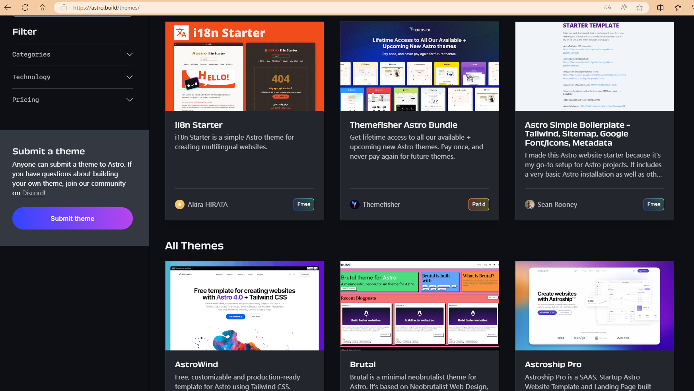
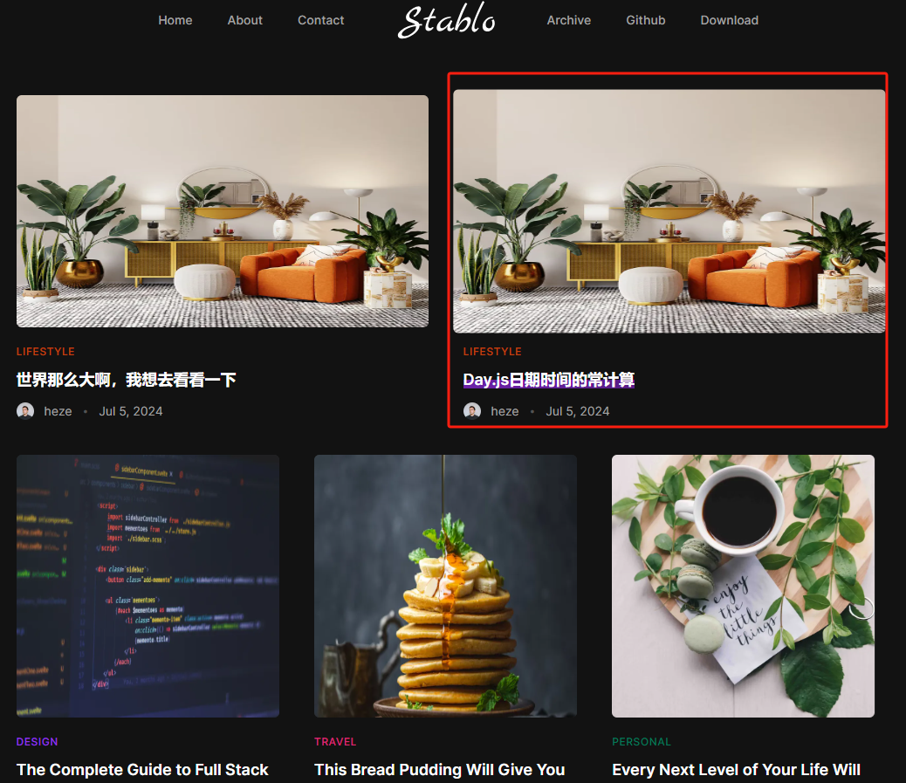
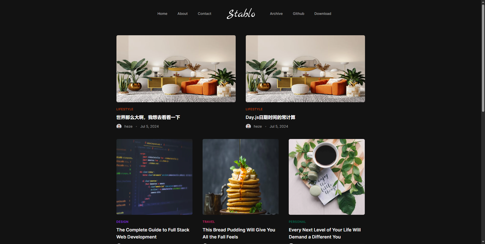
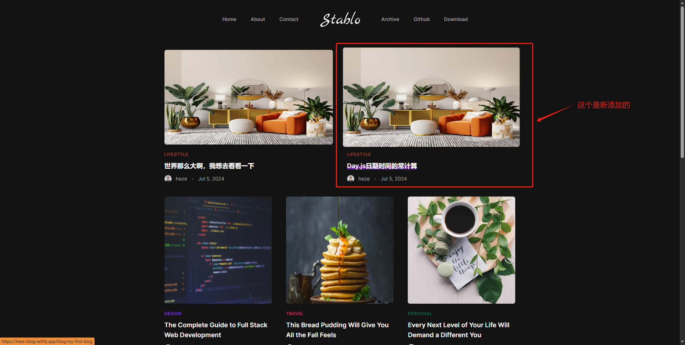
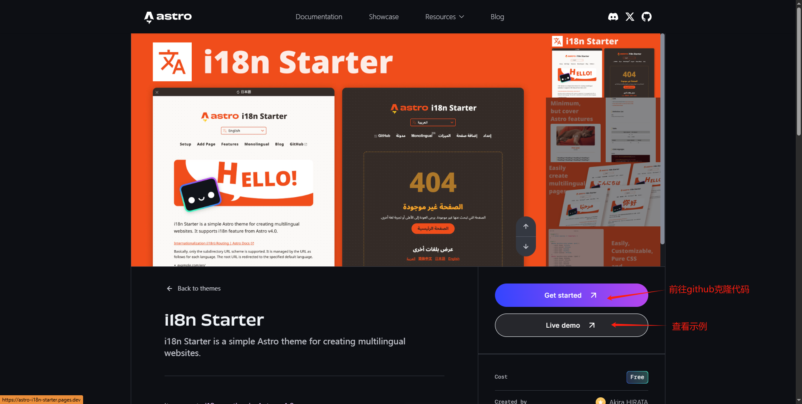

# Astro新前端框架首次体验

## 1、什么是Astro

Astro是一个静态网站生成器的前端框架，它提供了一种新的开发方式和更好的性能体验，帮助开发者更快速地构建现代化的网站和应用程序。

**简单来说就是**：Astro这个是一个网站生成器，可以直接通过提供的模版进行下载想要的网站模版，比如一般官网下载信息网站或者博客网站。

## 2、Astro特点

Astro还支持多种前端框架，包括React、Vue和Svelte等。开发者可以根据自己的喜好和需求选择合适的框架来开发网站。

Astro还具有优秀的性能和开发体验。它使用了编译时渲染的技术，可以将网站预先编译成静态文件，提供更快的加载速度和更好的SEO优化。同时，Astro还提供了热重载和即时预览等功能，使得开发过程更加高效和便捷。

**简单来说就是**：支持其他流行的前端框架，并且性能优化也挺好，易于上手，开发人员不用浪费太多时间。

## 3、快速使用Astro

**模版地址**：[Themes | Astro](https://astro.build/themes/)

1、选择一个`Free`的模版

2、查看模版详细

3、根据readme文件进行克隆下载安装在vscode编辑器上，查看运行

4、查看目录，找到对应需要更改数据的地方，这里是md文件，可以直接copymd文件过来，上面为标题信息

到这里就基本结束了，信息更换这个项目确实基本就完成了，模版结构不用改变，也可按需求。

## 4、使用免费服务器netlify部署

示例：使用github登录netlify

1、将克隆下来的项目更改后上传到github

2、使用github账号登录进netlify，并且选择你的仓库项目

3、进行选择仓库项目的部署

4、部署成功即可查看在netlify上面进行部署的网站

通过测试，只要新修改的代码上传到github上面，通过netlify部署的网站会自动更新（会有一点延迟），非常方便，如果有自己的域名，你可以换成你自己的域名。

到此，第一次使用和测试成功，这个前端框架在特定使用的场景感觉还是非常实用的，比如一般官网摸样、个人博客、下载网站等。世界很大，我想去看看。

