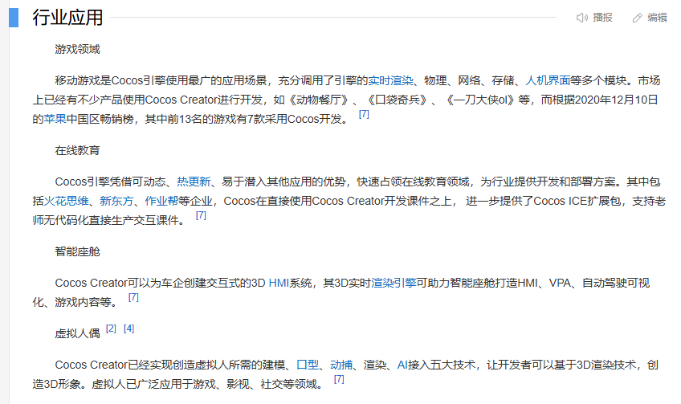
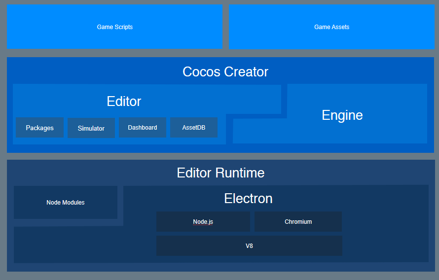
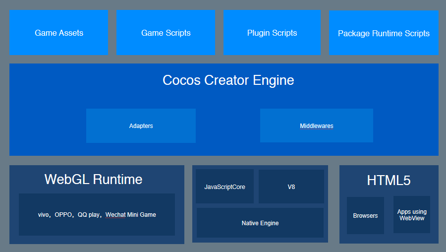
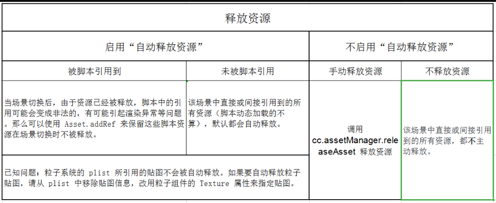

# Cocos Creator文档记录

## 一、什么是Cocos Creator

官方文档链接：[Hello World | Cocos Creator](https://docs.cocos.com/creator/2.4/manual/zh/getting-started/hello-world.html)

百度百科：[Cocos Creator_百度百科 (baidu.com)](https://baike.baidu.com/item/Cocos Creator/60664040?fr=ge_ala)

Cocos Creator包括开发和调试、商业化 SDK 的集成、多平台发布、测试、上线这一整套工作流程，可多次的迭代重复。

Cocos Creator 包含游戏引擎、资源管理、场景编辑、游戏预览和发布等游戏开发所需的全套功能，并且将所有的功能和工具链都整合在了一个统一的应用程序里。



编辑器在提供强大完整工具链的同时，提供了开放式的插件架构，开发者能够用 HTML + JavaScript 等前端通用技术轻松扩展编辑器功能，定制个性化的工作流程。





## 二、编辑器结构

- 资源管理器
- 场景编辑器
- 层级管理器
- 属性检查器
- 控件库
- 控制台
- 设置
- 项目设置
- 主菜单
- 工具栏
- 编辑器布局
- 构建预览

## 三、项目文件结构

~~~bash
ProjectName（项目文件夹）
├──assets			# 资源文件夹(本地资源、脚本和第三方库文件),会生成.meta存储资源配置和索引信息，第三方.tps等可以放在asset外面来管理
├──library			# 是assets中的资源导入后生成的,这里文件的结构和资源的格式将被处理成最终游戏发布时需要的形式。丢失或损坏的时候，删除重新打开项目可重新加载出来
├──local			# 包含该项目的本机上的配置信息，包括编辑器面板布局，窗口大小，位置等信息。开发者不需要关心这里的内容。
├──packages			# 用于放置此项目的自定义扩展插件。如需手动安装扩展插件，可以手动创建此文件夹。如需卸载扩展插件，在 packages 中删除对应的文件夹即可。
├──settings			# 保存项目相关的设置，如 构建发布 菜单里的包名、场景和平台选择等。
├──temp				# 临时文件夹，用于缓存一些 Cocos Creator 在本地的临时文件。这个文件夹可以在关闭 Cocos Creator 后手动删除，开发者不需要关心这里面的内容。
└──project.json		# project.json 文件和 assets 文件夹一起，作为验证 Cocos Creator 项目合法性的标志，只有包括了这两个内容的文件夹才能作为 Cocos Creator 项目打开。开发者不需要关心里面的内容。
└──build			# 构建目标（build）在使用主菜单中的 项目 -> 构建发布... 使用默认发布路径发布项目后，编辑器会在项目路径下创建 build 目录，并存放所有目标平台的构建工程。
~~~

**版本控制**:Cocos Creator 在新建项目时，会自动生成 `.gitignore` 文件，用于排除不应该提交到 git 仓库的文件。如果开发者使用其它版本控制系统，或者需要提交项目到其它地方，应该注意只需要提交 `assets`、`packages`、`settings`、`project.json`，或其它手动添加的关联文件。

## 四、基本工作流程

- **创建和管理场景**		勾选`自动释放资源`，切换到其他场景的时候就可以释放掉这个场景，减少内存占用

  

  **不延迟加载策略**：加载场景时，如果这个选项关闭，则这个场景直接或间接递归依赖的所有资源都将被加载，全部加载完成后才会触发场景切换。

  **延迟加载依赖的资源**：加载场景时，如果选项开启，则这个场景直接或间接依赖的所有贴图、粒子和声音都将被延迟到场景切换后才加载，使场景切换速度极大提升。

  同时，玩家进入场景后可能会看到一些资源陆续显示出来，并且激活新界面时也可能会看到界面中的元素陆续显示出来，因此这种加载方式更适合网页游戏。

  使用这种加载方式后，为了能在场景中更快地显示需要的资源，建议一开始就让场景中暂时不需要显示的渲染组件（如 Sprite）保持非激活状态。

  注意：Spine 和 TiledMap 依赖的资源永远都不会被延迟加载。

- **贴图资源**   目前包括 **JPG** 和 **PNG** 两种。设置图透明颜色等。

- **预制资源**   预制资源（Prefab）是预先配置好的游戏对象，可作为我们动态生成节点时使用的模板。

  ~~~js
  // 创建 Prefab
  Editor.Ipc.sendToPanel('scene', 'scene:create-prefab', node.uuid, 'db://assets/xxx/xxx.prefab');
  // 进入 Prefab 编辑模式：
  Editor.Ipc.sendToAll('scene:enter-prefab-edit-mode', assetUuid);
  // 保存 Prefab
  Editor.Ipc.sendToPanel('scene', 'scene:apply-prefab', node.uuid);
  ~~~

- **图集资源**   

  图集（Atlas）也称作 Sprite Sheet，是游戏开发中常见的一种美术资源。图集是通过专门的工具将多张图片合并成一张大图，并通过 **plist** 等格式的文件索引的资源。可供 Cocos Creator 使用的图集资源由 **plist** 和 **png** 文件组成。下面就是一张图集使用的图片文件：

  

- **自动图集资源**

  **自动图集资源** 作为 Cocos Creator 自带的合图功能，可以将指定的一系列碎图打包成一张大图，具体作用和 Texture Packer 的功能很相近。

- **压缩纹理**

  比如在手机平台上可能只需要原图 80% 或者更少的画质，又或者是没有使用到透明通道的 `.png` 可以将其转换成 `.jpg`，这样可以减少很大一部分图片的存储空间。

- **艺术数字资源**

  **艺术数字资源** **LabelAtlas.labelatlas** 是一种用户自定义的资源，它可以用来配置艺术数字字体的属性。

- **跨项目导入导出资源**

  在以场景和 Prefab 为内容组织核心的模式下，Cocos Creator 内置了场景（`.fire`) 和预制 (`.prefab`) 资源的导出和导入工具。

- **图像资源的自动裁剪**

  导入图像资源后生成的 SpriteFrame 会进行自动剪裁，去除原始图片周围的透明像素区域。这样我们在使用 SpriteFrame 渲染 Sprite 时，将会获得有效图像更精确的大小。

- **字体资源**

  使用 Cocos Creator 制作的游戏中可以使用三类字体资源：系统字体，动态字体和位图字体。TTF、fnt

- **还具有粒子资源、声音资源、Spine骨骼动画资源、瓦片图资源、JSON资源、文本资源等**

  

## 五、场景制作工作流程

此处省略：编辑器用两次就了解了...

~~~bash
# 文件层级目录 举例登录
login
	--picture
	--audio
	--prefab
	--Scene
	--Script
	--font
~~~

## 六、脚本开发指南

### 6.1、节点属性操作

~~~js
// 节点激活设置
this.node.active = false;
// 更改节点的变换（位置）
this.node.x = 100;
this.node.y = 50;
this.node.setPosition(100, 50);
this.node.setPosition(cc.v2(100, 50));
this.node.position = cc.v2(100, 50);
// 更改节点的变换（旋转）
this.node.rotation = 90;
this.node.setRotation(90);
this.node.scaleX = 2;
this.node.scaleY = 2;
this.node.setScale(2);
this.node.setScale(2, 2);
// 更改节点的变换（尺寸）
this.node.setContentSize(100, 100);
this.node.setContentSize(cc.size(100, 100));
this.node.width = 100;
this.node.height = 100;
// 更改节点的变换（缩放）
this.node.scaleX = 2;
this.node.scaleY = 2;
this.node.setScale(2);
this.node.setScale(2, 2);
// 更改锚点的变换（位置）
this.node.anchorX = 1;
this.node.anchorY = 0;
this.node.setAnchorPoint(1, 0);
// 更改节点的变换（颜色和透明度）
mySprite.node.color = cc.Color.RED;
mySprite.node.opacity = 128;
~~~

cc.Node的属性改变：

| 枚举对象定义 | 对应的事件名       | 事件触发的时机   |
| :----------- | :----------------- | :--------------- |
| 无           | `position-changed` | 当位置属性修改时 |
| 无           | `rotation-changed` | 当旋转属性修改时 |
| 无           | `scale-changed`    | 当缩放属性修改时 |
| 无           | `size-changed`     | 当宽高属性修改时 |
| 无           | `anchor-changed`   | 当锚点属性修改时 |

### 6.2、生命周期回调

Cocos Creator 为组件脚本提供了生命周期的回调函数。用户只要定义特定的回调函数，Creator 就会在特定的时期自动执行相关脚本，用户不需要手工调用它们。

目前提供给用户的生命周期回调函数主要有：

~~~bash
- onLoad					# onLoad 回调会在节点首次激活时触发。
- start                     # startstart 回调函数会在组件第一次激活前，也就是第一次执行 update 之前触发。start 通常用于初始化一些需要经常修改的数据，这些数据可能在 update 时会发生改变。     
- update					# update 游戏开发的一个关键点是在每一帧渲染前更新物体的行为，状态和方位。这些更新操作通常都放在 update 回调中。在所有动画更新前执行
- lateUpdate				# 在动效（如动画、粒子、物理等）更新之后才进行一些额外操作，或者希望在所有组件的 update 都执行完之后才进行其它操作，那就需要用到 lateUpdate 回调。
- onDestroy					# 当组件的 enabled 属性从 false 变为 true 时，或者所在节点的 active 属性从 false 变为 true 时，会激活 onEnable 回调。倘若节点第一次被创建且 enabled 为 true，则会在 onLoad 之后，start 之前被调用。
- onEnable					# 当组件的 enabled 属性从 true 变为 false 时，或者所在节点的 active 属性从 true 变为 false 时，会激活 onDisable 回调。
- onDisable					# 当组件或者所在节点调用了 destroy()，则会调用 onDestroy 回调，并在当帧结束时统一回收组件。当同时声明了 onLoad 和 onDestroy 时，它们将总是被成对调用。也就是说从组件初始化到销毁的过程中，它们要么就都会被调用，要么就都不会被调用。

~~~

一个组件从初始化到激活，再到最终销毁的完整生命周期函数调用顺序为：`onLoad` -> `onEnable` -> `start` -> `update` -> `lateUpdate` -> `onDisable` -> `onDestroy`。

其中，`onLoad` 和 `start` 常常用于组件的初始化，只有在节点 `activeInHierarchy` 的情况下才能调用，并且最多只会被调用一次。除了上文提到的内容以及调用顺序的不同，它们还有以下区别：

|        | 节点激活时 | 组件 enabled 时才会调用？ |
| :----: | :--------: | :-----------------------: |
| onLoad |  立即调用  |            否             |
| start  |  延迟调用  |            是             |

### 6.3、创建克隆和销毁节点

#### 6.3.1、创建新节点

除了通过场景编辑器创建节点外，我们也可以在脚本中动态创建节点。通过 `new cc.Node()` 并将它加入到场景中，可以实现整个创建过程。

#### 6.3.2、克隆已有节点

有时我们希望动态的克隆场景中的已有节点，我们可以通过 `cc.instantiate` 方法完成。使用方法如下：

~~~js
var scene = cc.director.getScene();
var node = cc.instantiate(this.node/this.prefab);

node.parent = scene;
node.setPosition(0, 0);
~~~

#### 6.3.3、销毁节点

通过 `node.destroy()` 函数，可以销毁节点。值得一提的是，销毁节点并不会立刻被移除，而是在当前帧逻辑更新结束后，统一执行。当一个节点销毁后，该节点就处于无效状态，可以通过 `cc.isValid` 判断当前节点是否已经被销毁。

### 6.4、加载和切换场景

#### 6.4.1、加载和运行场景

在 Cocos Creator 中，我们使用场景文件名（不包含扩展名）来索引指代场景。并通过以下接口进行加载和切换操作：

```js
cc.director.loadScene("MyScene");
```

除此之外，从 v2.4 开始 Asset Bundle 还增加了一种新的加载方式：

```js
bundle.loadScene('MyScene', function (err, scene) {
    cc.director.runScene(scene);
});
```

Asset Bundle 提供的 `loadScene` 只会加载指定 bundle 中的场景，并不会自动运行场景，还需要使用 `cc.director.runScene` 来运行场景。
`loadScene` 还提供了更多参数来控制加载流程，开发者可以自行控制加载参数或者在加载完场景后做一些处理。

#### 6.4.2、预加载场景

`cc.director.loadScene` 会在加载场景之后自动切换运行新场景，有些时候我们需要在后台静默加载新场景，并在加载完成后手动进行切换。那就可以预先使用 `cc.director.preloadScene` 接口对场景进行预加载：

```js
cc.director.preloadScene("table", function () {
    cc.log("Next scene preloaded");
});
```

之后在合适的时间调用 `loadScene`，就可以真正切换场景。

```js
cc.director.loadScene("table");
```

就算预加载没完成，依旧可以调用 `cc.director.loadScene`。

### 6.5、监听和发射事件

一般应用情况：客户端调用服务端协议异步请求的时候，数据还需要等待response，等待接口响应成功返回数据的时候，就可以发射一个事件用于告诉监听这个事件的已经获取到数据了。所以在需要使用数据的部分，添加一个监听就可以得到想要的数据操作。

不这样处理的后果：在接口协议未返回数据结构的时候，调用数据会出现报错Undefined或者null的情况，这是不应该出现的。

#### 6.5.1、监听事件

事件处理是在节点（`cc.Node`）中完成的。对于组件，可以通过访问节点 `this.node` 来注册和监听事件。监听事件可以通过 `this.node.on()` 函数来注册，方法如下：

~~~js
this.node.on('mousedown', function (event) {
  this.enabled = false;
}, this);
~~~

除了使用 `on` 监听，我们还可以使用 `once` 方法。`once` 监听在监听函数响应后就会关闭监听事件。

#### 6.5.2、关闭监听

当我们不再关心某个事件时，我们可以使用 `off` 方法关闭对应的监听事件。需要注意的是，`off` 方法的参数必须和 `on` 方法的参数一一对应，才能完成关闭。

~~~js
this.node.on('foobar', this._sayHello, this);
~~~

#### 6.5.3、发射事件

发射事件有两种方式：`emit` 和 `dispatchEvent`。两者的区别在于，后者可以做事件传递。我们先通过一个简单的例子来了解 `emit` 事件：

~~~js
this.node.emit('say-hello', 'Hello, this is Cocos Creator');
~~~

在 2.0 之后，我们优化了事件的参数传递机制。 在发射事件时，我们可以在 `emit` 函数的第二个参数开始传递我们的事件参数。同时，在 `on` 注册的回调里，可以获取到对应的事件参数

~~~js
let arg1 = 1, arg2 = 2, arg3 = 3;
// At most 5 args could be emit.
this.node.emit('foo', arg1, arg2, arg3);

this.node.on('foo', function (arg1, arg2, arg3) {
  console.log(arg1, arg2, arg3);  // print 1, 2, 3
});
~~~

需要说明的是，出于底层事件派发的性能考虑，这里最多只支持传递 5 个事件参数。所以在传参时需要注意控制参数的传递个数。

### 6.6、系统内置事件

#### 6.6.1、节点系统事件

Cocos Creator 支持的系统事件包含`鼠标、触摸、键盘、重力`传感四种，其中本章节重点介绍与节点树相关联的鼠标和触摸事件，这些事件是被直接触发在相关节点上的，所以被称为节点系统事件。与之对应的，键盘和重力传感事件被称为全局系统事件，细节可以参考下一节全局系统事件文档。

系统事件遵守通用的注册方式，开发者既可以使用枚举类型也可以直接使用事件名来注册事件的监听器，事件名的定义遵循 DOM 事件标准。

~~~js
// 使用枚举类型来注册
node.on(cc.Node.EventType.MOUSE_DOWN, function (event) {
  console.log('Mouse down');
}, this);

// 使用事件名来注册
node.on('mousedown', function (event) {
  console.log('Mouse down');
}, this);
~~~

#### 6.6.2、鼠标事件类型和事件对象

鼠标事件在桌面平台才会触发，系统提供的事件类型如下：

| 枚举对象定义                    | 对应的事件名 | 事件触发的时机                             |
| :------------------------------ | :----------- | :----------------------------------------- |
| `cc.Node.EventType.MOUSE_DOWN`  | `mousedown`  | 当鼠标在目标节点区域按下时触发一次         |
| `cc.Node.EventType.MOUSE_ENTER` | `mouseenter` | 当鼠标移入目标节点区域时，不论是否按下     |
| `cc.Node.EventType.MOUSE_MOVE`  | `mousemove`  | 当鼠标在目标节点区域中移动时，不论是否按下 |
| `cc.Node.EventType.MOUSE_LEAVE` | `mouseleave` | 当鼠标移出目标节点区域时，不论是否按下     |
| `cc.Node.EventType.MOUSE_UP`    | `mouseup`    | 当鼠标从按下状态松开时触发一次             |
| `cc.Node.EventType.MOUSE_WHEEL` | `mousewheel` | 当鼠标滚轮滚动时                           |

鼠标事件（`cc.Event.EventMouse`）的重要 API 如下（`cc.Event` 标准事件 API 除外）：

| 函数名                | 返回值类型 | 意义                                                         |
| :-------------------- | :--------- | :----------------------------------------------------------- |
| `getScrollY`          | `Number`   | 获取滚轮滚动的 Y 轴距离，只有滚动时才有效                    |
| `getLocation`         | `Object`   | 获取鼠标位置对象，对象包含 x 和 y 属性                       |
| `getLocationX`        | `Number`   | 获取鼠标的 X 轴位置                                          |
| `getLocationY`        | `Number`   | 获取鼠标的 Y 轴位置                                          |
| `getPreviousLocation` | `Object`   | 获取鼠标事件上次触发时的位置对象，对象包含 x 和 y 属性       |
| `getDelta`            | `Object`   | 获取鼠标距离上一次事件移动的距离对象，对象包含 x 和 y 属性   |
| `getButton`           | `Number`   | `cc.Event.EventMouse.BUTTON_LEFT` 或 `cc.Event.EventMouse.BUTTON_RIGHT` 或 `cc.Event.EventMouse.BUTTON_MIDDLE` |

#### 6.6.3、触摸事件类型和事件对象

触摸事件在移动平台和桌面平台都会触发，这样做的目的是为了更好得服务开发者在桌面平台调试，只需要监听触摸事件即可同时响应移动平台的触摸事件和桌面端的鼠标事件。系统提供的触摸事件类型如下：

| 枚举对象定义                     | 对应的事件名  | 事件触发的时机                   |
| :------------------------------- | :------------ | :------------------------------- |
| `cc.Node.EventType.TOUCH_START`  | `touchstart`  | 当手指触点落在目标节点区域内时   |
| `cc.Node.EventType.TOUCH_MOVE`   | `touchmove`   | 当手指在屏幕上移动时             |
| `cc.Node.EventType.TOUCH_END`    | `touchend`    | 当手指在目标节点区域内离开屏幕时 |
| `cc.Node.EventType.TOUCH_CANCEL` | `touchcancel` | 当手指在目标节点区域外离开屏幕时 |

触摸事件（`cc.Event.EventTouch`）的重要 API 如下（`cc.Event` 标准事件 API 除外）：

| API 名                | 类型       | 意义                                                       |
| :-------------------- | :--------- | :--------------------------------------------------------- |
| `touch`               | `cc.Touch` | 与当前事件关联的触点对象                                   |
| `getID`               | `Number`   | 获取触点的 ID，用于多点触摸的逻辑判断                      |
| `getLocation`         | `Object`   | 获取触点位置对象，对象包含 x 和 y 属性                     |
| `getLocationX`        | `Number`   | 获取触点的 X 轴位置                                        |
| `getLocationY`        | `Number`   | 获取触点的 Y 轴位置                                        |
| `getPreviousLocation` | `Object`   | 获取触点上一次触发事件时的位置对象，对象包含 x 和 y 属性   |
| `getStartLocation`    | `Object`   | 获取触点初始时的位置对象，对象包含 x 和 y 属性             |
| `getDelta`            | `Object`   | 获取触点距离上一次事件移动的距离对象，对象包含 x 和 y 属性 |

需要注意的是，触摸事件支持多点触摸，每个触点都会发送一次事件给事件监听器。

**触摸事件冒泡**：假设 A 节点拥有一个子节点 B，B 拥有一个子节点 C。开发者对 A、B、C 都监听了触摸事件（以下的举例都默认节点监听了触摸事件）。包含才会进行冒泡触发，如果在C点发生了触摸事件，那么会向上级冒泡到B，然后到A都会发生触摸事件，如果不想进行冒泡，那么调用 `event.stopPropagation()` 可以主动停止冒泡过程。

**同级节点的触点归属问题**：A和B属于同级，有一部分为公共部分，这时A发生触摸事件，但是B不会。

**将触摸或鼠标事件注册在捕获阶段**：如果希望父节点触发>子节点触发，可以给node注册触摸或鼠标事件时，传入第四个参数true，表示`useCapture`，例如：

~~~js
this.node.on(cc.Node.EventType.TOUCH_START, this.onTouchStartCallback, this, true);
~~~

当节点触发 `touchstart` 事件时，会先将 `touchstart` 事件派发给所有注册在捕获阶段的父节点监听器，然后派发给节点自身的监听器，最后才到了事件冒泡阶段。

只有触摸或鼠标事件可以注册在捕获阶段，其他事件不能注册在捕获阶段。

**多点触摸事件**：引擎在 v2.3 版本中新增了多点触摸事件的屏蔽开关，多点触摸事件默认为开启状态。对于有些类型的项目为了防止多点误触，需要屏蔽多点触摸事件，可以通过以下代码进行关闭：

~~~js
cc.macro.ENABLE_MULTI_TOUCH = false;
~~~

**暂停或恢复节点系统事件**

暂停节点系统事件：

~~~js
// 暂停当前节点上注册的所有节点系统事件，节点系统事件包含触摸和鼠标事件。
// 如果传递参数 true，那么这个 API 将暂停本节点和它的所有子节点上的节点系统事件。
// example
this.node.pauseSystemEvents();
~~~

恢复节点系统事件：

~~~js
// 恢复当前节点上注册的所有节点系统事件，节点系统事件包含触摸和鼠标事件。
// 如果传递参数 true，那么这个 API 将恢复本节点和它的所有子节点上的节点系统事件。
// example
this.node.resumeSystemEvents();
~~~

### 6.7、全局系统事件

全局系统事件是指与节点树不相关的各种全局事件，由 `cc.systemEvent` 来统一派发，目前支持以下几种事件：

- 键盘事件
- 设备重力传感事件

#### 6.7.1、如何定义输入事件

**键盘事件**

键盘、设备重力传感器此类全局事件是通过函数 `cc.systemEvent.on(type, callback, target)` 注册的。

可选的 `type` 类型有:

1. cc.SystemEvent.EventType.KEY_DOWN (键盘按下)
2. cc.SystemEvent.EventType.KEY_UP (键盘释放)
3. cc.SystemEvent.EventType.DEVICEMOTION (设备重力传感)

~~~js
cc.Class({
    extends: cc.Component,
    onLoad: function () {
        // add key down and key up event
        cc.systemEvent.on(cc.SystemEvent.EventType.KEY_DOWN, this.onKeyDown, this);
        cc.systemEvent.on(cc.SystemEvent.EventType.KEY_UP, this.onKeyUp, this);
    },

    onDestroy () {
        cc.systemEvent.off(cc.SystemEvent.EventType.KEY_DOWN, this.onKeyDown, this);
        cc.systemEvent.off(cc.SystemEvent.EventType.KEY_UP, this.onKeyUp, this);
    },

    onKeyDown: function (event) {
        switch(event.keyCode) {
            case cc.macro.KEY.a:
                console.log('Press a key');
                break;
        }
    },

    onKeyUp: function (event) {
        switch(event.keyCode) {
            case cc.macro.KEY.a:
                console.log('release a key');
                break;
        }
    }
});
~~~

**设备重力传感事件**

- 事件监听器类型：`cc.SystemEvent.EventType.DEVICEMOTION`
- 事件触发后的回调函数：
  - 自定义回调函数：`callback(event);`
- 回调参数

~~~js
cc.Class({
    extends: cc.Component,
    onLoad () {
        // open Accelerometer
        cc.systemEvent.setAccelerometerEnabled(true);
        cc.systemEvent.on(cc.SystemEvent.EventType.DEVICEMOTION, this.onDeviceMotionEvent, this);
    },
    
    onDestroy () {
        cc.systemEvent.off(cc.SystemEvent.EventType.DEVICEMOTION, this.onDeviceMotionEvent, this);
    },
    
    onDeviceMotionEvent (event) {
        cc.log(event.acc.x + "   " + event.acc.y);
    },
});
~~~

### 6.8、缓动系统(cc.tween)

#### 6.8.1、缓动系统介绍

Cocos Creator 在 v2.0.9 提供了一套新的 API —— `cc.tween`。`cc.tween` 能够对对象的任意属性进行缓动，功能类似于 [cc.Action（动作系统）](https://docs.cocos.com/creator/2.4/manual/zh/scripting/actions.html)。但是 `cc.tween` 会比 `cc.Action` 更加简洁易用，因为 `cc.tween` 提供了链式创建的方法，可以对任何对象进行操作，并且可以对对象的任意属性进行缓动。

`cc.tween` 提供了两个设置属性的 API：

- `to`：对属性进行绝对值计算，最终的运行结果即是设置的属性值，即改变到某个值。
- `by`：对属性进行相对值计算，最终的运行结果是设置的属性值加上开始运行时节点的属性值，即变化值。

~~~js
cc.tween(this.node)
    .to(1, { position: cc.v2(100, 100), rotation: 360 })	// 同时执行多个属性
    .to(1, { scale: 2 })
	.by(1, { scale: 1 }) // node.scale === 3
	.to(1, { scale: 1 }) // node.scale === 1
    .start()
~~~

#### 6.8.2、链式API

简单来说，是链式进行action缓动，所以一个结束后才会进行下一个。

`cc.tween` 的每一个 API 都会在内部生成一个 action，并将这个 action 添加到内部队列中，在 API 调用完后会再返回自身实例，这样就可以通过链式调用的方式来组织代码。

`cc.tween` 在调用 start 时会将之前生成的 action 队列重新组合生成一个 cc.sequence 队列，所以 `cc.tween` 的链式结构是依次执行每一个 API 的，也就是会执行完一个 API 再执行下一个 API。

~~~js
cc.tween(this.node)
    // 0s 时，node 的 scale 还是 1
    .to(1, { scale: 2 })
    // 1s 时，执行完第一个 action，scale 为 2
    .to(1, { scale: 3 })
    // 2s 时，执行完第二个 action，scale 为 3
    .start()
    // 调用 start 开始执行 cc.tween
~~~

#### 6.8.3、支持缓动任意对象的任意属性

~~~js
let obj = { a: 0 }
cc.tween(obj)
  .to(1, { a: 100 })
  .start()
~~~

####  6.8.4、easing使缓动更加生动

`cc.tween` 针对不同的情况提供了多种使用方式。

~~~js
// 传入 easing 名字，直接使用内置 easing 函数
cc.tween().to(1, { scale: 2 }, { easing: 'sineOutIn'})

// 使用自定义 easing 函数
cc.tween().to(1, { scale: 2 }, { easing: t => t*t; })

// 只对单个属性使用 easing 函数
// value 必须与 easing 或者 progress 配合使用
cc.tween().to(1, { scale: 2, position: { value: cc.v3(100, 100, 100), easing: 'sineOutIn' } })
~~~

#### 6.8.5、自定义progress

相对于 easing，自定义 progress 函数可以更自由的控制缓动的过程。

~~~js
// 对所有属性自定义 progress
cc.tween().to(1, { scale: 2, rotation: 90 }, {
  progress: (start, end, current, ratio) => {
    return start + (end - start) * ratio;
  }
})

// 对单个属性自定义 progress
cc.tween().to(1, {
  scale: 2,
  position: {
    value: cc.v3(),
    progress: (start, end, current, t) => {
      // 注意，传入的属性为 cc.Vec3，所以需要使用 Vec3.lerp 进行插值计算
      return start.lerp(end, t, current);
    }
  }
})
~~~

#### 6.8.6、复制缓动

clone 函数会克隆一个当前的缓动，并接受一个 target 作为参数。

~~~js
// 先创建一个缓动作为模板
let tween = cc.tween().to(4, { scale: 2 })

// 复制 tween，并使用节点 Canvas/cocos 作为 target
tween.clone(cc.find('Canvas/cocos')).start()
// 复制 tween，并使用节点 Canvas/cocos2 作为 target
tween.clone(cc.find('Canvas/cocos2')).start()
~~~

#### 6.8.7、插入其他的缓动到队列中

你可以事先创建一些固定的缓动，然后通过组合这些缓动形成新的缓动来减少代码的编写。

~~~js
let scale = cc.tween().to(1, { scale: 2 })
let rotate = cc.tween().to(1, { rotation: 90})
let move = cc.tween().to(1, { position: cc.v3(100, 100, 100)})

// 先缩放再旋转
cc.tween(this.node).then(scale).then(rotate)
// 先缩放再移动
cc.tween(this.node).then(scale).then(move)
~~~

#### 6.8.8、并行执行缓动

`cc.tween` 在链式执行时是按照 sequence 的方式来执行的，但是在编写复杂缓动的时候可能会需要同时并行执行多个队列，`cc.tween` 提供了 parallel 接口来满足这个需求。

~~~js
let t = cc.tween;
t(this.node)
    // 同时执行两个 cc.tween
    .parallel(
        t().to(1, { scale: 2 }),
        t().to(2, { position: cc.v2(100, 100) })
    )
    .call(() => {
        console.log('All tweens finished.')
    })
    .start()
~~~

#### 6.8.9、回调

~~~js
cc.tween(this.node)
    .to(2, { rotation: 90})
    .to(1, { scale: 2})
    // 当前面的动作都执行完毕后才会调用这个回调函数
    .call(() => { cc.log('This is a callback') })
    .start()
~~~

#### 6.8.10、重复执行

repeat/repeatForever 函数会将前一个 action 作为作用对象。但是如果有参数提供了其他的 action 或者 tween，则 repeat/repeatForever 函数会将传入的 action 或者 tween 作为作用对象。

~~~js
cc.tween(this.node)
    .by(1, { scale: 1 })
    // 对前一个 by 重复执行 10次
    .repeat(10)
    // 最后 node.scale === 11
    .start()

// 也可以这样用
cc.tween(this.node)
    .repeat(10,
        cc.tween().by(1, { scale: 1 })
    )
    .start()

// 一直重复执行下去
cc.tween(this.node)
    .by(1, { scale: 1 })
    .repeatForever()
    .start()
~~~

#### 6.8.11、延迟执行

~~~js
cc.tween(this.node)
    // 延迟 1s
    .delay(1)
    .to(1, { scale: 2 })
    // 再延迟 1s
    .delay(1)
    .to(1, { scale: 3 })
    .start()
~~~

### 6.9、计时器

也许有人会认为 `setTimeout` 和 `setInterval` 就足够了，开发者当然可以使用这两个函数，不过我们更推荐使用计时器，因为它更加强大灵活，和组件也结合得更好！

下面来看看它的具体使用方式：

首先，先创建一个指向某个组件的变量，变量名为 component。

1、开始一个计时器

~~~js
// 以秒为单位的时间间隔
var interval = 5;
// 重复次数
var repeat = 3;
// 开始延时
var delay = 10;
component.schedule(function() {
    // 这里的 this 指向 component
    this.doSomething();
}, interval, repeat, delay);
~~~

2、只执行一次的计时器（快捷方式）

~~~js
component.scheduleOnce(function() {
    // 这里的 this 指向 component
    this.doSomething();
}, 2);
~~~

3、取消计时器

~~~js
this.count = 0;
this.callback = function () {
    if (this.count === 5) {
        // 在第六次执行回调时取消这个计时器
        this.unschedule(this.callback);
    }
    this.doSomething();
    this.count++;
}
component.schedule(this.callback, 1);
~~~

**注意**：组件的计时器调用回调时，会将回调的 `this` 指定为组件本身，因此回调中可以直接使用 `this`。

下面是 Component 中所有关于计时器的函数：

- `schedule`：开始一个计时器
- `scheduleOnce`：开始一个只执行一次的计时器
- `unschedule`：取消一个计时器
- `unscheduleAllCallbacks`：取消这个组件的所有计时器

### 6.10、脚本执行顺序

#### 6.10.1、使用统一的控制脚本来初始化其他脚本

我们先设置一个 `Game.js` 脚本作为总的控制脚本，还有另外的 `Player.js`、`Enemy.js`、`Menu.js` 三个脚本，那么它们的初始化过程如下：

~~~js
// Game.js

const Player = require('Player');
const Enemy = require('Enemy');
const Menu = require('Menu');

cc.Class({
    extends: cc.Component,
    properties: {
        player: Player,
        enemy: Enemy,
        menu: Menu
    },

    onLoad: function () {
        this.player.init();
        this.enemy.init();
        this.menu.init();
    }
});
~~~

其中在 `Player.js`、`Enemy.js` 和 `Menu.js` 中需要实现 `init` 方法，并将初始化逻辑放进去。这样我们就可以保证 Player、Enemy 和 Menu 的初始化顺序。

#### 6.10.2、控制同一个节点上的组件执行顺序

在同一个节点上的组件脚本执行顺序，可以通过组件在 **属性检查器** 里的排列顺序来控制。排列在上的组件会先于排列在下的组件执行。我们可以通过组件右上角的齿轮按钮里的 `Move Up` 和 `Move Down` 菜单来调整组件的排列顺序和执行顺序。

还可以直接设置组件的 `executionOrder`。`executionOrder` 会影响组件的生命周期回调的执行优先级。设置方法如下：

~~~js
// Player.js
cc.Class({
    extends: cc.Component,
    editor: {
        executionOrder: -1
    },

    onLoad: function () {
        cc.log('Player onLoad!');
    }
});

// Menu.js
cc.Class({
    extends: cc.Component,
    editor: {
        executionOrder: 1
    },

    onLoad: function () {
        cc.log('Menu onLoad!');
    }
});
~~~

`executionOrder` 越小，该组件相对其它组件就会越先执行。`executionOrder` 默认为 0，因此设置为负数的话，就会在其它默认的组件之前执行。

`executionOrder` 只对 `onLoad`、`onEnable`、`start`、`update` 和 `lateUpdate` 有效，对 `onDisable` 和 `onDestroy` 无效。

### 6.11、标准网络接口

在 Cocos Creator 中，我们支持 Web 平台上最广泛使用的标准网络接口：

- **XMLHttpRequest**：用于短连接
- **WebSocket**：用于长连接

当然，在 Web 平台，浏览器原生就支持这两个接口，之所以说 Cocos Creator 支持，是因为在发布原生版本时，用户使用这两个网络接口的代码也是可以运行的。也就是遵循 Cocos 一直秉承的 “一套代码，多平台运行” 原则。

> **注意**：如果需要在原生平台使用 `WebSocket`，请确保有在 **项目 -> 项目设置 -> 模块设置** 中勾选了 **Native Socket** 模块。

#### 6.11.1、使用方法

1、XMLHttpRequest 简单示例：

~~~js
let xhr = new XMLHttpRequest();
xhr.onreadystatechange = function () {
    if (xhr.readyState == 4 && (xhr.status >= 200 && xhr.status < 400)) {
        var response = xhr.responseText;
        console.log(response);
    }
};
xhr.open("GET", url, true);
xhr.send();
~~~

开发者可以直接使用 `new XMLHttpRequest()` 来创建一个连接对象。

2、WebSocket 简单示例：

~~~js
let ws = new WebSocket("ws://echo.websocket.org");
ws.onopen = function (event) {
    console.log("Send Text WS was opened.");
};
ws.onmessage = function (event) {
    console.log("response text msg: " + event.data);
};
ws.onerror = function (event) {
    console.log("Send Text fired an error");
};
ws.onclose = function (event) {
    console.log("WebSocket instance closed.");
};

setTimeout(function () {
    if (ws.readyState === WebSocket.OPEN) {
        ws.send("Hello WebSocket, I'm a text message.");
    }
    else {
        console.log("WebSocket instance wasn't ready...");
    }
}, 3);
~~~

### 6.12、对象池

在运行时进行节点的创建（`cc.instantiate`）和销毁（`node.destroy`）操作是非常耗费性能的，因此我们在比较复杂的场景中，通常只有在场景初始化逻辑（`onLoad`）中才会进行节点的创建，在切换场景时才会进行节点的销毁。如果制作有大量敌人或子弹需要反复生成和被消灭的动作类游戏，我们要如何在游戏进行过程中随时创建和销毁节点呢？这里就需要对象池的帮助了。

对象池的基本功能其实非常简单，就是使用数组来保存已经创建的节点实例列表。

**对象池的概念**：

对象池就是一组可回收的节点对象，我们通过创建 `cc.NodePool` 的实例来初始化一种节点的对象池。通常当我们有多个 prefab 需要实例化时，应该为每个 prefab 创建一个 `cc.NodePool` 实例。当我们需要创建节点时，向对象池申请一个节点，如果对象池里有空闲的可用节点，就会把节点返回给用户，用户通过 `node.addChild` 将这个新节点加入到场景节点树中。

当我们需要销毁节点时，调用对象池实例的 `put(node)` 方法，传入需要销毁的节点实例，对象池会自动完成把节点从场景节点树中移除的操作，然后返回给对象池。这样就实现了少数节点的循环利用。假如玩家在一关中要杀死 100 个敌人，但同时出现的敌人不超过 5 个，那我们就只需要生成 5 个节点大小的对象池，然后循环使用就可以了。

**初始化对象池**：

在场景加载的初始化脚本中，我们可以将需要数量的节点创建出来，并放进对象池：

~~~js
//...
properties: {
    enemyPrefab: cc.Prefab
},
onLoad: function () {
    this.enemyPool = new cc.NodePool();
    let initCount = 5;
    for (let i = 0; i < initCount; ++i) {
        let enemy = cc.instantiate(this.enemyPrefab); // 创建节点
        this.enemyPool.put(enemy); // 通过 put 接口放入对象池
    }
}
~~~

**从对象池中拿出对象**：

~~~js
// ...

createEnemy: function (parentNode) {
    let enemy = null;
    if (this.enemyPool.size() > 0) { // 通过 size 接口判断对象池中是否有空闲的对象
        enemy = this.enemyPool.get();
    } else { // 如果没有空闲对象，也就是对象池中备用对象不够时，我们就用 cc.instantiate 重新创建
        enemy = cc.instantiate(this.enemyPrefab);
    }
    enemy.parent = parentNode; // 将生成的敌人加入节点树
    enemy.getComponent('Enemy').init(); //接下来就可以调用 enemy 身上的脚本进行初始化
}
~~~

**将对象返回对象池**：

~~~js
// ...

onEnemyKilled: function (enemy) {
    // enemy 应该是一个 cc.Node
    this.enemyPool.put(enemy); // 和初始化时的方法一样，将节点放进对象池，这个方法会同时调用节点的 removeFromParent
}
~~~

返还节点时，对象池内部会调用结点的 `removeFromParent(false)` 方法，将对象从父节点中移除，但并不会执行 `cleanup` 操作。这样我们就完成了一个完整的循环，主角需要刷多少怪都不成问题了！将节点放入和从对象池取出的操作不会带来额外的内存管理开销，因此只要是可能，应该尽量去利用。

**清除对象池**：

~~~js
myPool.clear(); // 调用这个方法就可以清空对象池
~~~

**使用cc.NodePool的优势**：

`cc.NodePool` 除了可以创建多个对象池实例，同一个 prefab 也可以创建多个对象池，每个对象池中用不同参数进行初始化，大大增强了灵活性；此外 `cc.NodePool` 针对节点事件注册系统进行了优化，用户可以根据自己的需要自由的在节点回收和复用的生命周期里进行事件的注册和反注册。

### 6.13、模块化脚本

Cocos Creator 允许你将代码拆分成多个脚本文件，并且让它们相互调用。要实现这点，你需要了解如何在 Cocos Creator 中定义和使用模块，这个步骤简称为 **模块化**。

**引用模块**

通常使用require，例如，已有一个脚本Rotate.js,接着我们就可以使用 Rotate 派生一个子类，新建一个脚本 `SinRotate.js`：

~~~js
// SinRotate.js

var Rotate = require("Rotate");

var SinRotate = cc.Class({
    extends: Rotate,
    update: function (dt) {
        this.rotation += this.speed * Math.sin(dt);
    }
});
~~~

这里我们定义了一个新的组件叫 SinRotate，它继承自 Rotate，并对 `update` 方法进行了重写。

同样的这个组件也可以被其它脚本接着访问，只要用 `require("SinRotate")`。

**注意**：

1. `require` 可以在脚本的任何地方任意时刻进行调用。
2. 游戏开始时会自动 require 所有脚本，这时每个模块内部定义的代码就会被执行一次，之后无论又被 require 几次，返回的始终是同一份实例。
3. 调试时，可以随时在 **Developer Tools** 的 **Console** 中 require 项目里的任意模块。

### 6.14、插件脚本

在 **资源管理器** 中选中任意一个脚本，就能在 **属性检查器** 中看到这样一个设置界面，我们可以在这里设置脚本是否 “导入为插件”。

- 对组件脚本，数据逻辑而言，一般默认都取消这个选项，这样的脚本简称 **普通脚本**。
- 对第三方插件，或者底层插件，就有可能需要选中选项，这样的脚本简称 **插件脚本**。

这个选项只和脚本有关，一般简单了解即可。

### 6.15、属性参数

>  属性参数用来给已定义的属性附加元数据，类似于脚本语言的 Decorator 或者 C# 的 Attribute。

## 七、子系统介绍

- **摄像机**

  摄像机是玩家观察游戏世界的窗口，场景中至少需要有一个摄像机，也可以同时存在多个摄像机。创建场景时，Creator 会默认创建一个名为 `Main Camera` 的摄像机，作为这个场景的主摄像机。多摄像机的支持可以让你轻松实现高级的自定义效果，比如双人分屏效果，或者场景小地图的生成。

- **Material 材质资源**

  材质资源可以用来控制渲染组件在场景中的视觉效果。简单来说材质就是用来指定物体表面的特性，如颜色、光亮程度、自发光度以及不透明度等。

- **effect**

  Cocos Creator 中的着色器（Cocos Shader ，文件扩展名为 *.effect），是一种基于 [YAML](https://docs.cocos.com/creator/3.8/manual/zh/shader/yaml-101.html) 和 [GLSL](https://docs.cocos.com/creator/3.8/manual/zh/shader/glsl.html) 的单源码嵌入式领域特定语言（single-source embedded domain-specific language），YAML 部分声明流程控制清单，GLSL 部分声明实际的 Shader 片段，这两部分内容相互补充，共同构成了一个完整的渲染流程描述。

- **Sprite 组件参考**

  Sprite（精灵）是 2D 游戏中最常见的显示图像的方式，在节点上添加 Sprite 组件，就可以在场景中显示项目资源中的图片。

- **Label 组件参考**

  Label 组件用来显示一段文字，文字可以是系统字体、TrueType 字体、BMFont 字体或艺术数字。另外，Label 还具有排版功能。

- **LabelOutline 组件参考**

  LabelOutline 组件将为所在节点上的 Label 组件添加描边效果，只能用于系统字体或者 TTF 字体。LabelOutline 组件在 Label 组件的 Cache Mode 属性设置为 CHAR 时不生效，除了原生平台，但是原生平台也只有在使用 TTF 字体时是生效的。

- **LabelShadow 组件参考**

  LabelShadow 组件可以为 Label 组件添加阴影效果，但只能用于系统字体或者 TTF 字体。LabelShadow 组件在 Label 组件的 Cache Mode 属性设置为 CHAR 时不生效，除了原生平台，但是原生平台也只有在使用 TTF 字体时是生效的。

- **Mask（遮罩）组件参考**

  Mask 用于规定子节点可渲染的范围，带有 Mask 组件的节点会使用该节点的约束框（也就是 **属性检查器** 中 Node 组件的 **Size** 规定的范围）创建一个渲染遮罩，该节点的所有子节点都会依据这个遮罩进行裁剪，遮罩范围外的将不会渲染。

- **MotionStreak（拖尾）组件参考**

  MotionStreak（拖尾）是运动轨迹，用于在游戏对象的运动轨迹上实现拖尾渐隐效果。

- **ParticleSystem 组件参考**

  该组件是用来读取 [粒子资源](https://docs.cocos.com/creator/2.4/manual/zh/asset-workflow/particle.html) 数据，并且对其进行一系列例如播放、暂停、销毁等操作。

- **TiledMap 组件参考**

  TiledMap（地图）用于在游戏中显示 TMX 格式的地图。

  TiledTile 组件可以单独对某一个地图块进行操作。

- **DragonBones 组件参考**

  DragonBones 组件可以对骨骼动画（DragonBones）资源进行渲染和播放。

  **注意**：当使用 DragonBones 组件时，**属性检查器** 中 Node 组件上的 **Anchor** 与 **Size** 属性是无效的。

- **VideoPlayer 组件参考**

  VideoPlayer 是一种视频播放组件，可通过该组件播放本地和远程视频。

  此控件支持的视频格式由所运行系统的视频播放器决定，为了让所有支持的平台都能正确播放视频，推荐使用 **mp4** 格式的视频。

- **WebView 组件参考**

  WebView 是一种显示网页的组件，该组件让你可以在游戏里面集成一个小的浏览器。由于不同平台对于 WebView 组件的授权、API、控制方式都不同，还没有形成统一的标准，所以目前只支持 Web、iOS 和 Android 平台。

- **Graphics 组件参考**

  Graphics 组件提供了一系列绘画接口，这些接口参考了 Canvas 的绘画接口来进行实现。

## 八、UI系统

### 8.1、多分辨率适配方案

Cocos Creator 在设计之初就致力于解决一套资源适配多种分辨率屏幕的问题。简单概括来说，我们通过以下几个部分完成多分辨率适配解决方案：

- **Canvas（画布）** 组件随时获得设备屏幕的实际分辨率并对场景中所有渲染元素进行适当的缩放。
- **Widget（对齐挂件）** 放置在渲染元素上，能够根据需要将元素对齐父节点的不同参考位置。
- **Label（文字）** 组件内置了提供各种动态文字排版模式的功能，当文字的约束框由于 Widget 对齐要求发生变化时，文字会根据需要呈现完美的排版效果。
- **Sliced Sprite（九宫格精灵图）** 则提供了可任意指定尺寸的图像，同样可以满足各式各样的对齐要求，在任何屏幕分辨率上都显示高精度的图像。

### 8.2、自动布局容器

Layout（自动布局）组件可以挂载在任何节点上，将节点变成一个有自动布局功能的容器。所谓自动布局容器，就是能够自动将子节点按照一定规律排列，并可以根据节点内容的约束框总和调整自身尺寸的容器型节点。

- **水平布局**（Horizontal)
- **垂直布局**（Vertical）
- **垂节点排列方向**
- **节点排列方向**
- **水平排列方向**（Horizontal Direction）
- **垂直排列方向**（Vertical Direction）

### 8.3、制作动态生成内容的列表

UI 界面只有静态页面内容是不够的，我们会遇到很多需要由一组数据动态生成多个元素组成的 UI 面板，比如选人界面、物品栏、选择关卡等等。

### 8.4、UI组件参考

- **Canvas（画布）组件**

  **Canvas（画布）** 组件能够随时获得设备屏幕的实际分辨率并对场景中所有渲染元素进行适当的缩放。场景中的 Canvas 同时只能有一个，建议所有 UI 和可渲染元素都设置为 Canvas 的子节点。

- **Widget 组件**

  Widget (对齐挂件) 是一个很常用的 UI 布局组件。它能使当前节点自动对齐到父物体的任意位置，或者约束尺寸，让你的游戏可以方便地适配不同的分辨率。

- **Button（按钮）组件**

  Button 组件可以响应用户的点击操作，当用户点击 Button 时，Button 自身会有状态变化。另外，Button 还可以让用户在完成点击操作后响应一个自定义的行为。

- **Layout 组件参考**

  Layout 是一种容器组件，容器能够开启自动布局功能，自动按照规范排列所有子物体，方便用户制作列表、翻页等功能。

  - 水平布局容器
  - 垂直布局容器
  - 网格布局容器

- **SafeArea 组件**

  该组件会将所在节点的布局适配到 iPhone X 等异形屏手机的安全区域内，可适配 Android 和 iOS 设备，通常用于 UI 交互区域的顶层节点。需要注意的是在添加 SafeArea 组件时，会自动添加 Widget 组件（如果节点上没有的话），且不能删除。

- **EditBox 组件**

  EditBox 是一种文本输入组件，该组件让你可以轻松获取用户输入的文本。

- **RichText 组件**

  RichText 组件用来显示一段带有不同样式效果的文字，你可以通过一些简单的 BBCode 标签来设置文字的样式。 目前支持的样式有：颜色（color）、字体大小（size）、字体描边（outline）、加粗（b）、斜体（i）、下划线（u）、换行（br）、图片（img）和点击事件（on），并且不同的 BBCode 标签支持相互嵌套。

- **ScrollView 组件**

  ScrollView 是一种带滚动功能的容器，它提供一种方式可以在有限的显示区域内浏览更多的内容。通常 ScrollView 会与 **Mask** 组件配合使用，同时也可以添加 **ScrollBar** 组件来显示浏览内容的位置。

- **ScrollBar 组件**

  ScrollBar 允许用户通过拖动滑块来滚动一张图片，它与 `Slider` 组件有点类似，但是 ScrollBar 主要是用于滚动，而 Slider 则用来设置数值。

- **ProgressBar 组件**

  ProgressBar（进度条）经常被用于在游戏中显示某个操作的进度，在节点上添加 ProgressBar 组件，然后给该组件关联一个 Bar Sprite 就可以在场景中控制 Bar Sprite 来显示进度了。

- **Toggle 组件**

  Toggle 是一个 CheckBox，当它和 ToggleGroup 一起使用的时候，可以变成 RadioButton。

- **ToggleContainer 组件**

  ToggleContainer 不是一个可见的 UI 组件，它可以用来修改一组 Toggle 组件的行为。当一组 Toggle 属于同一个 ToggleContainer 的时候，任何时候只能有一个 Toggle 处于选中状态。

- **Slider 组件**

  Slider 是一个滑动器组件。

- **PageView 组件**

  PageView 是一种页面视图容器.

- **PageviewIndicator 组件**

  PageviewIndicator 用于显示 PageView 当前的页面数量和标记当前所在的页面。

- **BlockInputEvents 组件**

  BlockInputEvents 组件将拦截所属节点 bounding box 内的所有输入事件（鼠标和触摸），防止输入穿透到下层节点，一般用于上层 UI 的背景。

  当我们制作一个弹出式的 UI 对话框时，对话框的背景默认不会截获事件。也就是说虽然它的背景挡住了游戏场景，但是在背景上点击或触摸时，下面被遮住的游戏元素仍然会响应点击事件。这时我们只要在背景所在的节点上添加这个组件，就能避免这种情况。

  该组件没有任何 API 接口，直接添加到场景即可生效。

## 总结：

这里记录简单的结构和概括记录主要的编辑器和脚本知识，由于篇幅较长，后续还有进阶的部分放在下一个文章中记录。


